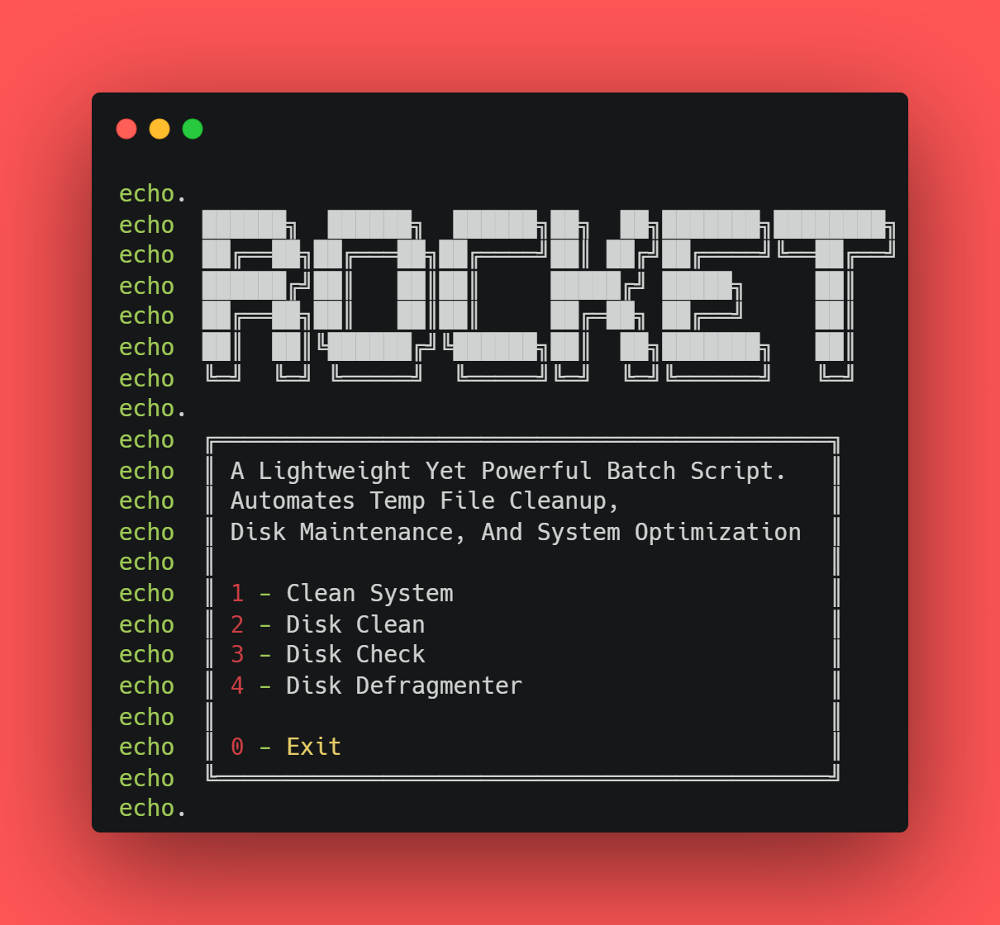
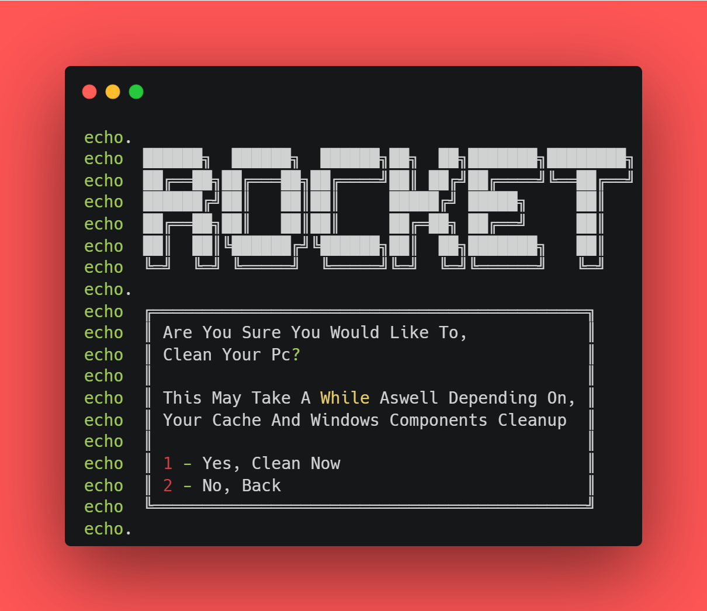
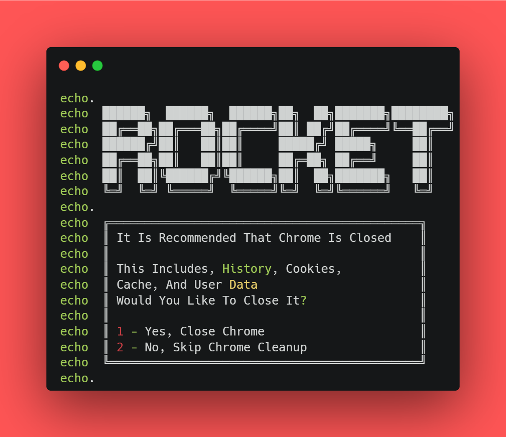
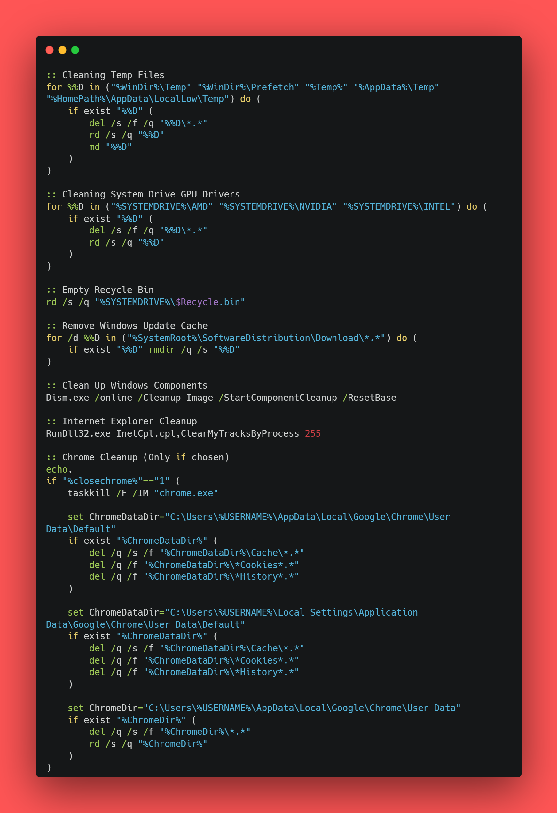

<div align="center">
  
</div>

<div align="center">
    <br>
    
    
    <br>
     
    
    <br>
    
    
    <br>
    Made with ❤️💻 by DevBubba
</div>
<hr style="border-radius: 2%; margin-top: 60px; margin-bottom: 60px;" noshade="" size="20" width="100%">


# <a id="description"></a>🚀 〢 Rocket Cleaner

### A lightweight yet powerful batch script that automates temp file cleanup, disk maintenance, and system optimization. Features an interactive menu, admin privilege handling, and fast execution. Portable & efficient!


## <a id="content"></a>🌐 〢 Table Of Contents

- **[📖 〢 Description](#description)**
- **[🔰 〢 Features](#features)**
- **[🔗 〢 Discord](https://discord.gg/6qAvAephsW)**
- **[💻 〢 Prerequisites](#prerequisites)**
- **[📥 〢 Install](#install)**
- **[❓ 〢 FAQ](#faq)**
- **[📷 〢 Preview](#preview)**
- **[📝 〢 Notes](#notes)**
- **[📚 〢 Changelog](#changelog)**
- **[⚠️〢 Bugs Or Errors](#bugsorerrors)**
- **[🧾 〢 Lisence](#lisence)**


## <a id="features"></a>🔰 〢 Features

- `Uses Built In Windows Functions`🟢
  - Leverages native Windows commands (disk cleanup, disk check, and defragmenter) to perform system maintenance.
- `Functional Temp Cleaner With Chrome Support`🟢
  - Cleans temporary files including those related to Chrome.
- `Admin Privilege Handling`🟢
  - Checks for administrative rights and relaunches with elevated privileges if necessary.
- `User Interface (Menu-Based System)`🟢
  - Presents an interactive menu with options for different cleaning and maintenance tasks.
- `Auto Update (Version Control)`🟢
  - Automatically checks for & installs the latest version.
- `Fast Execution`🟢
  - Designed to perform tasks quickly with minimal overhead.
- `Portable`🟢
  - Does not require installation and can run from any location.
- `Executable Version (.exe)`🟡
  - Compiled an executable version for easier distribution and usage.
- `More Options`🟡
  - Future expansion to include additional maintenance tasks.
- `Clear All Browser Cache`🟡
  - Planned feature to extend cleaning to all major browsers.
- `Works On Other Devices Other Than Windows`🔴
  - Currently designed and made exclusively for Windows environments.

🟢 = Working  | 🟡 = To Do  | 🔴 = Not Working


## <a id="prerequisites"></a>💻 〢 Prerequisites

- Windows 10 or later
- Administrator privileges (required for system maintenance tasks)
  
  
## <a id="install"></a>📥 〢 Install

1. **Download**
   - Clone this repository:
     ```sh
     git clone https://github.com/devbubba/Rocket-Cleaner.git
     ```
   - Or download the latest or prefered release [here](https://github.com/devbubba/Rocket-Cleaner/releases).
2. **Running Rocket Cleaner**
   - Locate `RocketCleaner.bat` in the project folder.
   - **Right-click and select "Run as administrator"** to ensure full functionality.
   - Follow the on-screen menu prompts to clean your system.  

### 🔧 Optional: Moving the Executable and Creating a Shortcut

You can remove the extra repository files if you wish to run **Rocket Cleaner** from a preferred directory. Simply follow these steps:

1. **Remove Unnecessary Files:**  
   - Move `RocketCleaner.bat` (and any other necessary configuration files, if applicable in the future) to your preferred directory.
   - You may delete the remaining repository files if they are not needed for your use.

2. **Create a Desktop Shortcut:**  
   - **Manual Shortcut:**  
     - Right-click the relocated `RocketCleaner.bat` file and select **Create Shortcut**.
     - Drag the shortcut to your desktop (or any preferred location).
     - Right-click the shortcut, choose **Properties**, click the **Shortcut** tab, then the **Advanced** button, and finally check **Run as administrator**.
   
   - **Automated Shortcut (Optional Script):**  
     You can also create a simple batch script to automatically create a desktop shortcut. Save the following as `create_shortcut.bat` or any other applicable name in the same folder as `Rocket Cleaner.bat` and run it:
     ```bat
     @echo off
     set "TARGET=%~dp0Rocket Cleaner.bat"
     set "SHORTCUT=%userprofile%\Desktop\Rocket Cleaner.lnk"
     
     powershell -Command "$s=(New-Object -COM WScript.Shell).CreateShortcut('%SHORTCUT%');$s.TargetPath='%TARGET%';$s.WorkingDirectory='%~dp0';$s.Save()"
     
     echo Shortcut created on Desktop. Right-click the shortcut, go to Properties, and set 'Run as administrator' if needed.
     pause
     ```

## <a id="faq"></a>❓ 〢 FAQ

- **Q: How often should I run Rocket Cleaner?**  
  A: It's recommended to run Rocket Cleaner periodically, depending on your usage. If you're using many applications or browsing the web frequently, you may want to run it weekly to keep your system optimized.

- **Q: Does Rocket Cleaner delete my personal files?**  
  A: No, Rocket Cleaner only removes temporary system files, browser cache, and other files that can safely be deleted. It does not delete any personal files, documents, or photos.

- **Q: I ran Rocket Cleaner without admin rights, and some features didn't work. What should I do?**  
  A: Certain features require admin privileges (e.g., disk cleanup and defragmentation). Make sure to **right-click and select "Run as administrator"** when launching Rocket Cleaner to ensure full functionality.

- **Q: How do I disable the auto-update feature?**  
  A: Currently, the auto-update feature is built-in. If you wish to disable it, you can modify the script, but it's recommended to keep it enabled to ensure you're always using the latest version with improvements and fixes.

- **Q: Can I use Rocket Cleaner on my Mac or Linux system?**  
  A: Rocket Cleaner is designed exclusively for Windows. Future versions may support other operating systems, but for now, it is Windows-only.

## <a id="preview"></a>📷 〢 Preview

<div align="center">
    <hr style="border-radius: 2%; margin-top: 60px; margin-bottom: 60px;" noshade="" size="20" width="75%">    
    </img>
    </img>
    </img>
    </img>
    <hr style="border-radius: 2%; margin-top: 60px; margin-bottom: 60px;" noshade="" size="20" width="75%"> 
</div>

## <a id="notes"></a>📝 〢 Notes 

- The auto-update feature requires an active internet connection to check for the latest version.
- Running the script without admin privileges may limit functionality.
- Some features, like defragmentation, may take longer depending on the system's state.
- The desktop file fixer will be reintroduced once stability improvements are made.

## <a id="bugsorerrors"></a>⚠️ 〢 Bugs Or Errors?

- Report A Bug, Issue, Or Error On The **[Issues Page](https://github.com/DevBubba/Rocket-Cleaner/issues)**
- Join The **[Discord](https://discord.gg/6qAvAephsW)** For Community Support


## <a id="changelog"></a>📚 〢 Changelog 

- All Notable Changes To Rocket-Cleaner (This Project) Will Be Documented In This [Changelog File](https://github.com/DevBubba/Rocket-Cleaner/blob/main/CHANGELOG.md)


## <a id="lisence"></a>🧾 〢 License

- Rocket Cleaner is licensed under the [MIT License](https://mit-license.org/)


<hr style="border-radius: 2%; margin-top: 60px; margin-bottom: 60px;" noshade="" size="20" width="100%">
