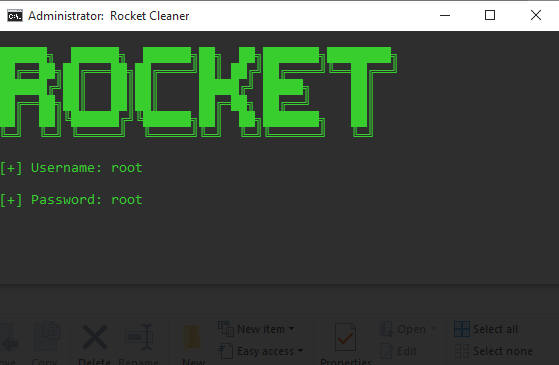
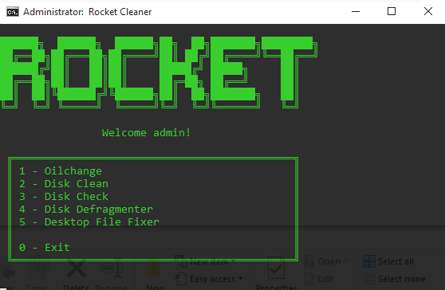

  

     
    
    
     
     
    
     
    
    
     

#  🚀 〢 Rocket Cleaner

### Simple Yet Advanced System Multi Tool And Cleaner Made In Batch!

## 🌐 〢 Table Of Contents

- **[📖 〢 Description](#description)**
- **[🔰 〢 Features](#features)**
- **[🔗 〢 Discord](https://discord.gg/6qAvAephsW)**
- **[📥 〢 Install](#install)**
  - **[💻 〢 Prerequisites](#prerequisites)**
- **[📷 〢 Preview](#preview)**
- **[⚠️ 〢 Bugs Or Errors](#bugsorerrors)**
- **[🧾 〢 Lisence](#lisence)**

##  🔰 〢 Features

- `Requires Administrator To Fix Any Bugs`🟢
- `Multiple Cleaning And Tool Options`🟢
- `Executable Version (.exe)`🟢
- `Very Fast`🟢
- `Portable`🟢
- `Multiple Obfuscation Choices`🟢
- `More Options`🟡
- `Clear All Browser Cache`🟡
- `Works On Other Devices Other Than Windows`🔴

🟢 = Working  | 🟡 = To Do  | 🔴 = Not Working

##  📥 〢 Install

###  💻 〢 Prerequisites

-   Windows 7/10/11

##  📷 〢 Preview

    
    
    </img>
    </img>
    
 

##  ⚠️ Bugs Or Errors?

-   To Report An Error Make An **[Issue](https://github.com/DevBubba/Rocket-Cleaner/issues)**
-   Or Join The **[Discord](https://discord.gg/6qAvAephsW)**

## 🧾  License

### Rocket Cleaner is licensed under the <a href="https://mit-license.org/.">MIT License</a>

